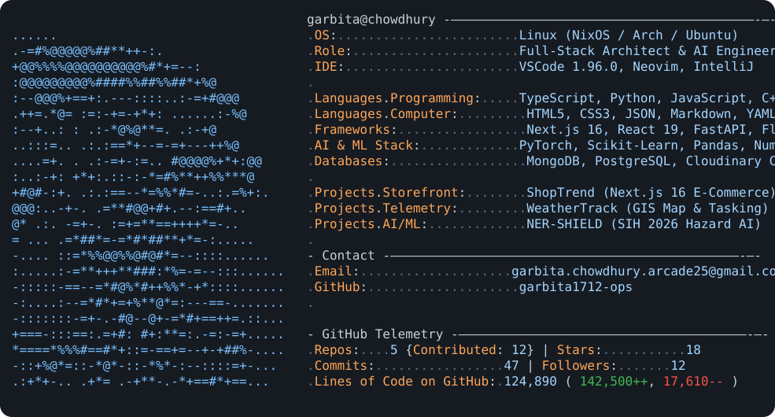

  <!-- Dynamic Neofetch Terminal HUD -->
  <picture>
    <source media="(prefers-color-scheme: dark)" srcset="dark_mode.svg">
    <source media="(prefers-color-scheme: light)" srcset="light_mode.svg">
    
  </picture>

    

  <!-- Glassmorphic Badges -->
  

    
    
    
  

 

---

<h2 align="center">INTERACTIVE TECH STACK</h2>

   

  <!-- Interactive Skill Icons Grid -->
  

    

  <!-- Technology Badges -->
  

    
    
    
    
    
    
    
  

 

---

<h2 align="center">CONTRIBUTION SNAKE MATRIX ANIMATION</h2>

  <picture>
    <source media="(prefers-color-scheme: dark)" srcset="https://raw.githubusercontent.com/garbita1712-ops/garbita1712-ops/output/github-snake-dark.svg">
    <source media="(prefers-color-scheme: light)" srcset="https://raw.githubusercontent.com/garbita1712-ops/garbita1712-ops/output/github-snake.svg">
    
  </picture>

 

---

<h2 align="center">REAL-TIME ANALYTICS & STREAKS</h2>

  

    
  

   

  <table border="0" width="100%">
    <tr>
      <td width="50%" align="center">
        
      </td>
      <td width="50%" align="center">
        
      </td>
    </tr>
  </table>

   

  <table border="0" width="100%">
    <tr>
      <td width="50%" align="center">
        
      </td>
      <td width="50%" align="center">
        
      </td>
    </tr>
  </table>

 

---

<h2 align="center">ABOUT &amp; BIOGRAPHY</h2>

  

    <b>B.Tech CSE Student &amp; Full-Stack Web Developer | Winner, SIH Internal Hackathon | WBJEE Rank 1102</b>
  

   
  

    Computer Science student at <b>Kalyani Govt. Engineering College (KGEC)</b> with expertise across Full-Stack Web development including <code>TypeScript</code>, <code>Next.js</code>, <code>NextAuth (JWT)</code>, <code>React</code>, <code>Docker</code>, <code>Tailwind CSS</code>, <code>MongoDB</code>, <code>Vercel</code>, <code>HTML5</code>, <code>Node.js</code>, and <code>Python</code>. Skilled in Graphic Designing, Video Editing, Generative AI, Problem Solving, and Public Speaking.
  

   

  <!-- Big Handwritten Cursive Signature -->
  <picture>
    <source media="(prefers-color-scheme: dark)" srcset="signature_dark.svg">
    <source media="(prefers-color-scheme: light)" srcset="signature_light.svg">
    
  </picture>

