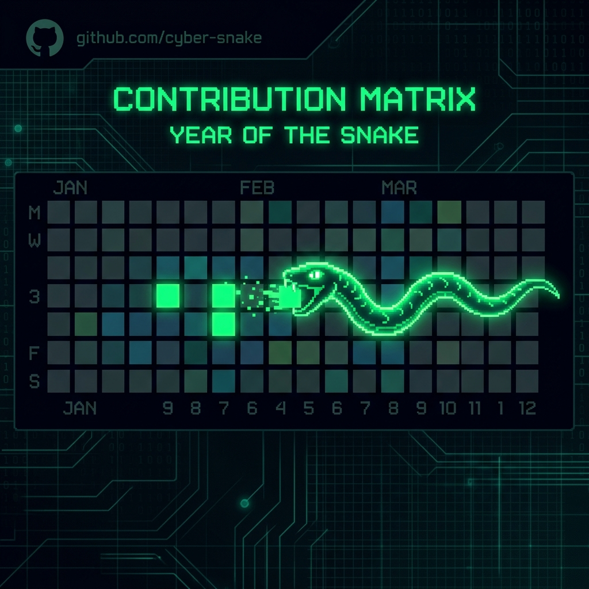
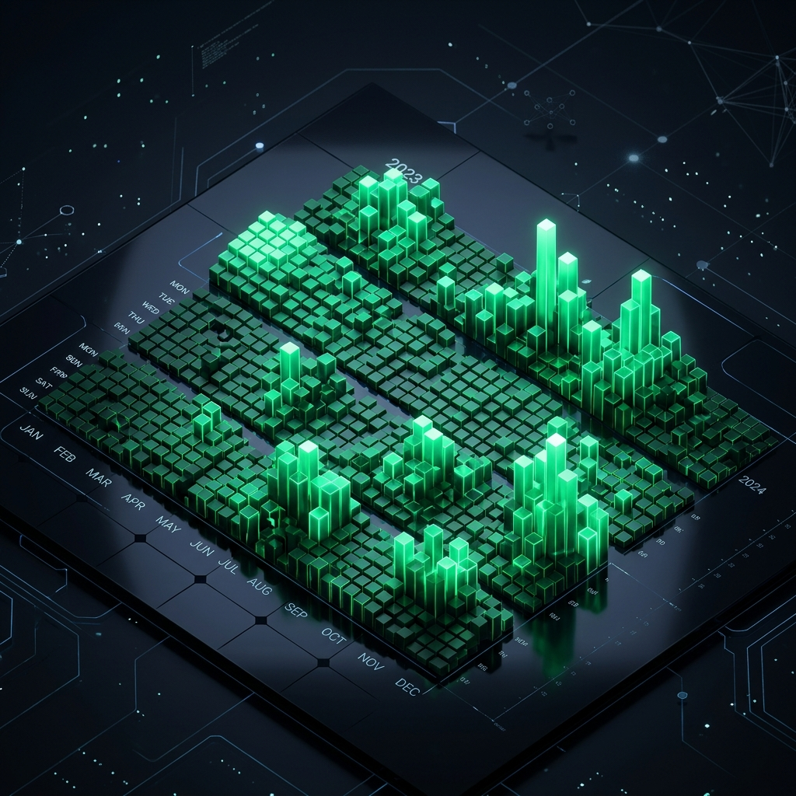

<div align="center">

  <!-- Anime Cyberpunk Developer Background Banner -->
  <a href="https://github.com/garbita1712-ops">
    
  </a>

  <br /><br />

  <!-- 3D Glassmorphism Logo Badge -->
  

  <br /><br />

  <!-- Animated Typing SVG Header -->
  

  <br />

  <!-- Glassmorphic Badges -->
  <p align="center">
    <a href="https://github.com/garbita1712-ops">
      
    </a>
    <a href="mailto:garbita.chowdhury.arcade25@gmail.com">
      
    </a>
    
  </p>

</div>

---

### Architecture Profile

```yaml
┌────────────────────────────────────────────────────────────────────────┐
│                        GARBITA CHOWDHURY                               │
│                [ Full-Stack & AI Systems Architect ]                    │
├────────────────────────────────────────────────────────────────────────┤
│    Core Stack    : Next.js 16 (Turbopack) | TypeScript | Python        │
│    Intelligence  : PyTorch | Scikit-Learn | GIS Spatial Telemetry      │
│    Infrastructure: MongoDB | Cloudinary CDN | Docker | Vercel          │
│    UI Aesthetic  : Modern Glassmorphism & Cyberpunk Neon HUD          │
└────────────────────────────────────────────────────────────────────────┘
```

---

### Interactive Skills & Technologies

<div align="center">

  <br />

  <!-- Interactive Skill Icons Grid -->
  <a href="https://skillicons.dev">
    
  </a>

  <br /><br />

  <!-- Technology Badges -->
  <p>
    
    
    
    
    
    
    
  </p>

</div>

---

### Contribution Snake Matrix Animation

<div align="center">
  
</div>

---

### 3D Isometric Contribution Landscape

<div align="center">
  
</div>

---

### Live Profile Analytics & Streaks

<div align="center">

  <p align="center">
    
  </p>

  <br />

  <table border="0">
    <tr>
      <td>
        
      </td>
      <td>
        
      </td>
    </tr>
  </table>

  <br />

  <table border="0">
    <tr>
      <td>
        
      </td>
      <td>
        
      </td>
    </tr>
  </table>

</div>

---

### Featured Production Projects

| Project | Tech Stack | Highlight Feature | Link |
| :--- | :--- | :--- | :---: |
| **ShopTrend** | `Next.js 16` `MongoDB` `Cloudinary` | Full-stack E-Commerce storefront with auto Cloudinary image destruction and admin catalog management. | [Repo](https://github.com/garbita1712-ops/ShopTrend) |
| **WeatherTrack** | `Next.js` `TypeScript` `Leaflet GIS` | Borderless GIS weather platform with live telemetry search, task tracking, and dynamic widgets. | [Repo](https://github.com/garbita1712-ops/WeatherTrack) |
| **NER-SHIELD** | `FastAPI` `Flutter` `ISRO Telemetry` | SIH 2026 AI hazard prediction pipeline with real-time risk scoring and remote SMS fallback. | [Repo](https://github.com/garbita1712-ops) |

---

<div align="center">
  <p><i>"Simplicity and aesthetics are the prerequisites for software reliability."</i></p>
  <p>Engineered with Cyberpunk Glassmorphism Aesthetics by <b>Garbita Chowdhury</b></p>
</div>
